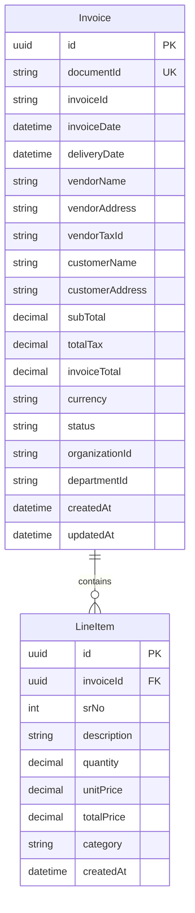

# Database Schema - ER Diagram

## Entity Relationship Diagram



## Relationships

- **Invoice → LineItem**: One-to-Many (1:N)
  - One invoice can have multiple line items
  - Each line item belongs to exactly one invoice
  - Foreign Key: `LineItem.invoiceId` references `Invoice.id`

## Table Details

### Invoice Table
Primary table storing invoice header information.

**Key Fields:**
- `id` - Unique identifier (UUID, Primary Key)
- `documentId` - Document identifier (Unique Key)
- `invoiceId` - Invoice number/reference
- `invoiceDate` - Date the invoice was issued
- `vendorName` - Vendor/supplier name
- `invoiceTotal` - Total amount (including tax)
- `status` - Processing status (e.g., "processed", "pending")

**Indexes:**
- Primary Key on `id`
- Unique constraint on `documentId`
- Index on `invoiceDate` for date-based queries
- Index on `vendorName` for vendor analytics

### LineItem Table
Stores individual line items for each invoice.

**Key Fields:**
- `id` - Unique identifier (UUID, Primary Key)
- `invoiceId` - Reference to parent invoice (Foreign Key)
- `srNo` - Line item sequence number
- `description` - Item description
- `quantity` - Quantity ordered
- `unitPrice` - Price per unit
- `totalPrice` - Total price (quantity × unitPrice)
- `category` - Item category for analytics

**Indexes:**
- Primary Key on `id`
- Foreign Key on `invoiceId` references `Invoice(id)`
- Index on `category` for category-based analytics

## Data Types

- **uuid**: Universally Unique Identifier
- **string**: Variable-length text
- **decimal**: Precise numeric values for financial data
- **int**: Integer values
- **datetime**: Timestamp with timezone

## Business Rules

1. Each invoice must have at least one line item
2. `invoiceTotal` should equal `subTotal + totalTax`
3. Line item `totalPrice` should equal `quantity × unitPrice`
4. `documentId` must be unique across all invoices
5. Invoice dates should not be in the future
6. Currency defaults to "EUR"

## Sample Queries

### Get invoice with line items:
```sql
SELECT i.*, l.*
FROM "Invoice" i
LEFT JOIN "LineItem" l ON l."invoiceId" = i.id
WHERE i."invoiceId" = 'INV-2024-001';
```

### Top vendors by spend:
```sql
SELECT "vendorName", SUM("invoiceTotal") as total_spend
FROM "Invoice"
GROUP BY "vendorName"
ORDER BY total_spend DESC
LIMIT 10;
```

### Category breakdown:
```sql
SELECT l."category", SUM(l."totalPrice") as category_total
FROM "LineItem" l
GROUP BY l."category"
ORDER BY category_total DESC;
```
